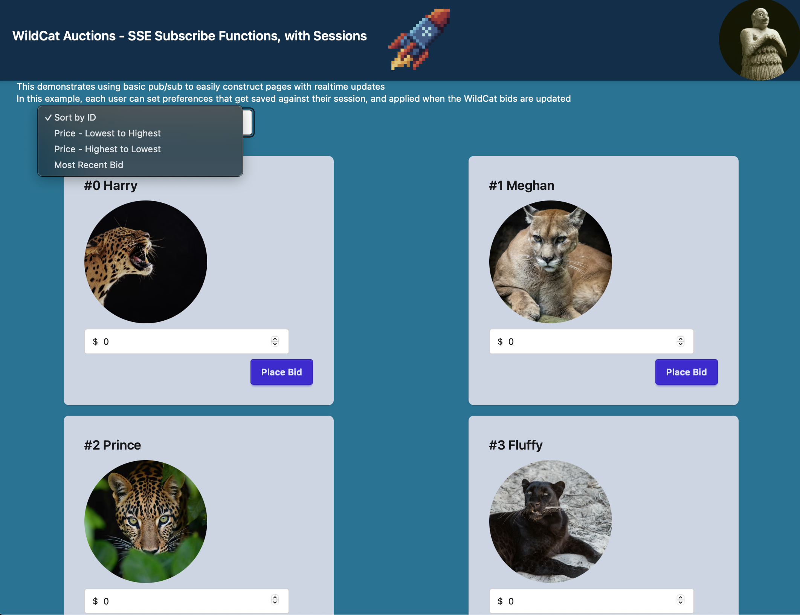

# Datastar lib for zig 0.16-dev


A Zig library for 0.16 / latest async/concurrent stdlib that conforms to the Datastar SDK specification.

https://github.com/starfederation/datastar/blob/develop/sdk/ADR.md

.. and passes the official test cases.

Versions :
- Datastar 1.0.0-RC7
- Zig 0.16.x

See Also http://github.com/zigster64/datastar.http.zig for the Datastar SDK for zig 0.15.2 sitting on top of http.zig

# Audience and Scope

Who is this repo for ?

- Anyone interested in using Datastar. https://data-star.dev.

It is a state of the art Hypermedia-first library for building apps. 

Its not "yet another frontend framework" - its a 10kb JS shim that allows you to write application code
at the backend, and leverage modern browser standards to have a very fast, very light, reactive UI 
with none of the junk. There are no build steps, no npm deps - just declarative HTML and reactive signals,
driven from the backend.

If you know, you know.

It uses a well defined SSE-first protocol that is backend agnostic - you can use the the same simple 
SDK functions to write the same app in Go, Clojure, C#, PHP, Python, Bun, Ruby, Rust, Lisp, Racket, Java, etc. 

This project adds Zig to that list of supported SDK languages.

It uses the exact same spec as all the other SDK's, and reads extremely similarly to say - a Go program
or a Python program using the same SDK.

Why consider the Zig version then ? Who is that for ?

- Existing Zig programmers who want to try Datastar
- Datastar app builders who want to experiment with performance, and dabble in new backend languages

Consider Zig if every microsecond counts, or you want stupidly small memory footprints that dont grow.

Zig gives you some pretty good tuning options if you want to chase benchmarks and break records too.

We are talking orders of magnitude performance and resource usage gains for your existing Datastar app, depending
on what you are currently using. 

Try it out.

# Quick Start Introduction

If you just want to quickly install this, and try out the demo programs first, do this :

```
... get zig 0.16-dev installed on your machine
git clone https://github.com/zigster64/datastar.zig
cd datastar.zig
zig build
./zig-out/bin/01_basic
```

Then open your browser to http://localhost:8081


This will bring up a kitchen sink app that shows each of the SDK functions in use in the browser, with a 
section that displays the code to use on your backend to drive the page you are looking at.


---

To run the additional example apps, try

`./zig-out/bin/example_2` - a simple cat auction site.
Bring up multiple browser windows and watch the bids get updated in realtime to all windows.


---

`./zig-out/bin/example_22` - a more complex cat aution site, with session based preferences managed at the backend.
Bring up multiple browser windows and watch the bids get updated in realtime to all windows.
Change preferences, and watch that all browser windows in the same session get their preferences updated.

Use a different machine, or browser, or use the 'Profiles' feature in Chrome/Safari/Firefox to simulate a new session.
Note that the bids update in realtime across all browsers, and just the preferences changes are sticky across all 
windows belonging to the same machine/profile.



---

`./zig-out/bin/example_5` - an excellent and exciting multi-player farming simulator, where users can plant and attend 
to various crops to help them grow to harvest (or whither and die if neglected)


# Validation Test

When you run `zig build`, it will compile several apps into `./zig-out/bin` including a binary called `validation-test`

Run `./zig-out/bin/validation-test`, which will start a server on port 7331

Then follow the procedure documented at

https://github.com/starfederation/datastar/blob/main/sdk/tests/README.md

To run the official Datastar validation suite against this test harness

The source code for the `validation-test` program is in the file `tests/validation.zig`

Current version passes all tests.


# Example Apps

When you run `zig build` it will compile several apps into `./zig-out/bin/` to demonstrate using different parts 
of the api

- example_1  shows using the Datastar API using basic SDK handlers
- example_2  shows an example multi-user auction site for cats with realtime updates using pub/sub
- example_22 Same cat auction as above, but with per-user preferences, all handled on the backend only

<!-- - example_3  shows an example multi-user pigeon racing betting site with realtime updates -->
<!-- - example_4  shows an example multi-game, multi-player TicTacToe site, using the backstage actor framework -->

- example_5  shows an example multi-player Gardening Simulator using pub/sub


# Installation and Usage

To build an application using this SDK

1) Add datastar.zig as a dependency in your `build.zig.zon`:

```bash
zig fetch --save="datastar" "git+https://github.com/zigstser64/datastar.zig#master"
```

2) In your `build.zig`, add the `datastar` module as a dependency you your program:

```zig
const datastar = b.dependency("datastar", .{
    .target = target,
    .optimize = optimize,
});

// the executable from your call to b.addExecutable(...)
exe.root_module.addImport("datastar", datastar.module("datastar"));
```

# Web Server ?

This 0.16 Version of the Datastar SDK includes a basic web server and fast radix-tree based router that uses the stdlib server.

You can use this built-in server if you want to start experiminting with Zig 0.16-dev, as it has no other dependencies outside of stdlib.

Full example of a main() using the 

```zig 
const std = @import("std");
const datastar = @import("datastar");

const Io = std.Io;

const PORT = 8080;

pub fn main() !void {
    var gpa = std.heap.GeneralPurposeAllocator(.{}){};
    const allocator = gpa.allocator();

    var threaded: Io.Threaded = .init(allocator);
    defer threaded.deinit();
    const io = threaded.io();

    // Create a server listening on all IP addresses, including IPv6
    const HTTPServer = datastar.Server(void);
    var server = try HTTPServer.initIp6(io, allocator, PORT);
    defer server.deinit();

    // Add some routes with different http methods
    const r = server.router;
    r.get("/", index);
    r.get("/text-html", textHtml);
    r.get("/patch", patchElements);
    r.post("/patch/opts", patchElementsOpts);
    r.get("/code/:snip", code);

    std.debug.print("Server listening on http://localhost:{}\n", .{PORT});

    // optional function to reboot the server on re-compile
    // try this if you are doing local dev - is handy
    try server.rebooter();

    // everything is set, so start the server up
    try server.run();
}

// all handlers receive a single HTTPRequest param
fn index(http: *datastar.HTTPRequest) !void {
    // http has verbs such as html() to send HTML, json() to send JSON, etc
    return try http.html(@embedFile("index.html"));
}

fn patchElements(http: *datastar.HTTPRequest) !void {
    // here we call NewSSE() on the http request, which sets this into 
    // event-stream mode.
    var sse = try datastar.NewSSE(http);
    defer sse.close(); // Sends off the SSE event stream, and closes the connection

    try sse.patchElementsFmt(
        \\<p id="mf-patch">This is update number {d}</p>
    ,
        .{getCountAndIncrement()},
        .{},
    );
}
```

# Functions

## Cheatsheet of all Datastar SDK functions

```zig
const datastar = @import("datastar");

// read signals either from GET or POST
http.readSignals(comptime T: type) !T  // for use with the built in HTTPServer, where http = *HTTPRequest
datastar.readSignals(comptime T: type, arena: std.mem.Allocator, req: *std.http.Server.Request) !T // generic interface if you are not using the built in HTTPServer

// set the connection to SSE, and return an SSE object
var sse = datastar.NewSSE(http) !SSE
var sse = datastar.NewSSESync(http) !SSE
var sse = datastar.NewSSEOpt(http, sse_options) !SSE

// when you are finished with this connection
sse.close()

// when you want to keep the connection alive for a long time 
// then call this in your handler. It will continue until the 
// browser closes the connection
sse.keepalive(io, duration)

// patch elements function variants
sse.patchElements(elementsHTML, elements_options) !void
sse.patchElementsFmt(comptime elementsHTML, arguments, elements_options) !void
sse.patchElementsWriter(elements_options) *std.Io.Writer 

// patch signals function variants
sse.patchSignals(value, json_options, signals_options) !void
sse.patchSignalsWriter(signals_options) *std.Io.Writer

// execute scripts function variants
sse.executeScript(script, script_options) !void
sse.executeScriptFmt(comptime script, arguments, script_options) !void
sse.executeScriptWriter(script_options) *std.Io.Writer
```

## Cheatsheet of all HTTPServer functions

```zig
// Generate a Server type that has no global context
Server(void)
... handler signatures are handler(HTTPRequest)
// Generate a Server type that takes a type as a global app context
Server(T)
server.setContext(ctx)
... handler signatures are handler(Context, HTTPRequest)

// create a server given an address
server.init(io, allocator, address, port) !Server
// create a server listening on all interfaces with IPv6
server.initIp6(io, allocator, port) !Server
// server instance cleanup
server.deinit()
// run the server
server.run()
// tell the whole app to reload and reboot whenever the program is re-compiled
server.rebooter()
```

The built in HTTPServer provides a simple fast router 

```zig
var app = App.init(allocator); // create a global state context for this app
var server = try datastar.Server(*App).initIp6(io, allocator, PORT);
var r = server.router;  // get the router from the Server we created

r.get(path, handler)
r.post(path, handler)
r.patch(path, handler)
r.delete(path, handler)

// Generic route
r.add(method, path, handler)

// Path Parameters example
r.get("/users/:id", userHandler)

fn userHandler(app: *App, http *HTTPRequest) !void {
    const id = http.params.get("id");
    ...
}

```

When using the built in HTTPServer, all handlers receive either : 
- a single paramater of type `*HTTPRequest` for servers of type `Server(void)`
- a context, and a `*HTTPRequest` for servers of type `Server(T)`


This HTTPRequest has the following features :

```zig
// Internal values

http.req     - the *std.http.Server.Request value
http.io      - which std.Io interface is in use when calling this handler
http.arena   - a per-request arena for doing allocations in your handler
http.params  - the route parameters used in the request

// Functions
http.html(data) !void            // output data as text/html
http.htmlFmt(format, args) !void // print formatted output data as text/html
http.json(data) !void            // convert data to JSON and output as application/json
http.query() ![]const u8         // get the query string for this request 
http.readSignals(T) !T           // read the signals from the request into struct of given type

// Route Parameters 
http.params.get(name) ?[]const u8  // get the value of named parameter :name
```

The built in functions allow you to easily return text/html or application/json. (as well as Datastar SSE actions, as shown below)

If you want to do anything more exotic, just use the `http.req` to construct whatever other response type you might need ... the new 0.16 stdlib
provides a lot of very low level control options for returning responses there.

# Using the Datastar SDK

## The SSE Object

Calling NewSSE, passing a HTTPRequest, will return an object of type SSE.

```zig
    pub fn NewSSE(http) !SSE 
```

This will configure the connnection for SSE transfers, and provides an object with Datastar methods for
patching elements, patching signals, executing scripts, etc.

When you are finished with this SSE object, you must call `sse.close()` to finish the handler.

When running in this default mode (named internally as 'batched mode'), all of the SSE patches are batched
up, and then passed up to the HTTP library for transmission, and closing the connection.

In batched mode, the entire payload is sent as a single transmission with a fixed content-length header, 
and no chunked encoding.

You can declare your sse object early in the handler, and then set headers / cookies etc at any time 
in the handler. Because actual network updates are batched till the end, everything goes out in the correct order.

```zig
    pub fn NewSSESync(http) !SSE 
```
Will create an SSE object that will do immediate Synchronous Writes to the browser as each `patchElements()` call is made.

Finally, there is a NewSSE variant that takes a set of options, for special cases

```zig
    pub fn NewSSEOpt(http, SSEOptions) !SSE

    // Where options are 
    const SSEOptions = struct {
        buffer_size: usize = 16 * 1024, // internal buffer size for batched mode
        sync: bool = false,
    };
```

## Reading Signals from the request

Using the built in HTTPServer
```zig
    pub fn http.readSignals(comptime T: type) !T
```

Using other HTTP Server libs - generic version 
```zig
    pub fn datastar.readSignals(comptime T: type, arena: std.mem.Allocator, req: *std.http.Server.Request) !T
```

Will take a Type (struct) and a HTTP request, and returns a filled in struct of the requested type.

If the request is a `HTTP GET` request, it will extract the signals from the query params. You will see that 
your GET requests have a `?datastar=...` query param in most cases. This is how Datastar passes signals to
your backend via a GET request.

If the request is a `HTTP POST` or other request that uses a payload body, this function will use the 
payload body to extract the signals. This is how Datastar passes signals to your backend when using POST, etc.

Either way, provide `readSignals` with a type that you want to read the signals into, and it will use the
request method to work out which way to fill in the struct.

Example :
```zig
    const FooBar = struct {
        foor: []const u8,
        bar: []const u8,
    };

    const signals = try http.readSignals(FooBar);
    std.debug.print("Request sent foo: {s}, bar: {s}\n", .{signals.foo, signals.bar});
```

If you prefer, you can use anonymous structs too - can make the code more readable :

```zig
    const signals = try http.readSignals(struct {foo: []const u8, bar: []const u8});
    std.debug.print("Request sent foo: {s}, bar: {s}\n", .{signals.foo, signals.bar});
```


## Patching Elements

The SDK Provides 3 functions to patch elements over SSE.

These are all member functions of the SSE type that NewSSE(http) returns.


```zig
    pub fn patchElements(self: *SSE, elements: []const u8, opt: PatchElementsOptions) !void

    pub fn patchElementsFmt(self: *SSE, comptime elements: []const u8, args: anytype, opt: PatchElementsOptions) !void

    pub fn patchElementsWriter(self: *SSE, opt: PatchElementsOptions) *std.Io.Writer 
```

Use `sse.patchElements` to directly patch the DOM with the given "elements" string.

Use `sse.patchElementsFmt` to directly patch the DOM with a formatted print (where elements,args is the format string + args).

Use `sse.patchElementsWriter` to return a std.Io.Writer object that you can programmatically write to using complex logic.

When using the writer, you can call `w.flush()` to manually flush the writer ... but you generally 
dont need to worry about this, as the sse object will correctly terminate an existing writer, as
soon as the next `patchElements / patchSignals` is issued, or at the end of the handler cleanup
as the `defer sse.close() / defer sse.deinit()` functions are called.

See the example apps for best working examples.


PatchElementsOptions is defined as :

```zig
pub const PatchElementsOptions = struct {
    mode: PatchMode = .outer,
    selector: ?[]const u8 = null,
    view_transition: bool = false,
    event_id: ?[]const u8 = null,
    retry_duration: ?i64 = null,
    namespace: NameSpace = .html,
};

pub const PatchMode = enum {
    inner,
    outer,
    replace,
    prepend,
    append,
    before,
    after,
    remove,
};

pub const NameSpace = enum {
    html,
    svg,
    mathml,
};
```

See the Datastar documentation for the usage of these options when using patchElements.

https://data-star.dev/reference/sse_events

Most of the time, you will want to simply pass an empty tuple `.{}` as the options parameter. 

Example handler (from `examples/01_basic.zig`)

```zig
fn patchElements(req: *httpz.Request, res: *httpz.Response) !void {
    var sse = try datastar.NewSSE(http);
    defer sse.close();

    try sse.patchElementsFmt(
        \\<p id="mf-patch">This is update number {d}</p>
    ,
        .{getCountAndIncrement()},
        .{},
    );
}
```

## Patching Signals

The SDK provides 2 functions to patch signals over SSE.

These are all member functions of the SSE type that NewSSE(http) returns.

```zig
    pub fn patchSignals(self: *SSE, value: anytype, json_opt: std.json.Stringify.Options, opt: PatchSignalsOptions) !void

    pub fn patchSignalsWriter(self: *SSE, opt: PatchSignalsOptions) *std.Io.Writer
```

PatchSignalsOptions is defined as :
```zig
pub const PatchSignalsOptions = struct {
    only_if_missing: bool = false,
    event_id: ?[]const u8 = null,
    retry_duration: ?i64 = null,
};
```

Use `patchSignals` to directly patch the signals, passing in a value that will be JSON stringified into signals.

Use `patchSignalsWriter` to return a std.Io.Writer object that you can programmatically write raw JSON to.

Example handler (from `examples/01_basic.zig`)
```zig
fn patchSignals(req: *httpz.Request, res: *httpz.Response) !void {
    var sse = try datastar.NewSSE(http);
    defer sse.close();

    const foo = prng.random().intRangeAtMost(u8, 0, 255);
    const bar = prng.random().intRangeAtMost(u8, 0, 255);

    try sse.patchSignals(.{
        .foo = foo,
        .bar = bar,
    }, .{}, .{});
}
```

## Executing Scripts

The SDK provides 3 functions to initiate executing scripts over SSE.

```zig

    pub fn executeScript(self: *SSE, script: []const u8, opt: ExecuteScriptOptions) !void

    pub fn executeScriptFmt(self: *SSE, comptime script: []const u8, args: anytype, opt: ExecuteScriptOptions) !void 

    pub fn executeScriptWriter(self: *SSE, opt: ExecuteScriptOptions) *std.Io.Writer
```

ExecuteScriptOptions is defined as :
```zig
pub const ExecuteScriptOptions = struct {
    auto_remove: bool = true, // by default remove the script after use, otherwise explicity set this to false if you want to keep the script loaded
    attributes: ?ScriptAttributes = null,
    event_id: ?[]const u8 = null,
    retry_duration: ?i64 = null,
};
```

Use `executeScript` to send the given script to the frontend for execution.

Use `executeScriptFmt` to use a formatted print to create the script, and send it to the frontend for execution. 
Where (script, args) is the same as print(format, args).

Use `executeScriptWriter` to return a std.Io.Writer object that you can programmatically write the script to, for
more complex cases.

Example handler (from `examples/01_basic.zig`)
```zig
fn executeScript(req: *httpz.Request, res: *httpz.Response) !void {
    const value = req.param("value"); // can be null

    var sse = try datastar.NewSSE(http);
    defer sse.close();

    try sse.executeScriptFmt("console.log('You asked me to print {s}')"", .{
            value orelse "nothing at all",
    });
}
```

# Advanced SSE Topics

## Synchronous Writes 

By default, when you create a `NewSSE(http)`, and do various actions on it such as `patchElements()`, this 
will buffer up the converted SSE stream, which is then written to the client browser as the request is 
finalised.

In some cases you may want to do Synchronous Writes to the client browser as each operation is performed in the
handler, so that as each `patchElements()` call is made, the patch is written immediately to the browser.

In this case use `NewSSESync(http)` to set the SSE into Synchronous Mode.

For example - in the SVGMorph demo, we want to generate a randomized SVG update, then write that to the client 
browser, then pause for 100ms and repeat, to provide a smooth animation of the SVG.

## Namespaces - SVG and MathML (Datastar RC7 feature)

`patchElements()` works great when morphing small fragments into existing DOM content, using the element ID,
or other selectors.

Unfortunately, when we have a large chunk of SVG or MathML content, the standard HTML morphing 
cannot reach down inside the SVG markup to pick out individual child elements for individual updates.

However, you can now use the `.namespace = svg` or `.namespace = mathml` options for `patchElements()` now
to do exactly this.

See the SVG and MathML demo code in example_1 to see this in action.

# Publish and Subscribe

The `datastar.http.zig` SDK (here - https://github.com/zigster64/datastar.http.zig) has a built in pub/sub
system that exploits the fact that http.zig allows you to detach sockets from handlers for later use.

In Zig 0.16 - The recommended approach here will be to use the Evented IO to create long running coroutines 
for those handlers that want to subscribe to topics.

For publishing to topics in a production environment, then just connect in a message bus such as Redis, or NATS, or Postgres listen/notify and thats all thats needed.

This version of the SDK also implements the pub/sub  

# Long Lived Connections

When using a pub/sub setup with your application (be it the built in pubsub, or some more robust multi-service messaging backbone), you will want
your connections to be long lived.

Some examples for different ways to acheive this :

```zig
// Using the built in pub-sub
// Sit this thread in a loop that will generate keepalive pings every 30 seconds
// whilst other threads write data to the same connection via the publish callback
fn catsList(app: *App, http: *HTTPRequest) !void {
    var sse = try datastar.NewSSESync(http);

    try app.subscribers.subscribe("cats", &sse, App.publishCatList);
    sse.keepalive(http.io, .fromSeconds(30));
    subs.unsubscribe(&sse);
}

// Using an external pub-sub message queue
fn catsList(app: *App, http: *HTTPRequest) !void {
    var sse = try datastar.NewSSESync(http);

    var mq = app.pubsub.subscribe("cats");
    while (mq.next()) {
        app.publishCatList();
    }
}


```


# Contrib Policy

All contribs welcome.

Please raise a github issue first before adding a PR, and reference the issue in the PR title. 

This allows room for open discussion, as well as tracking of issues opened and closed.

